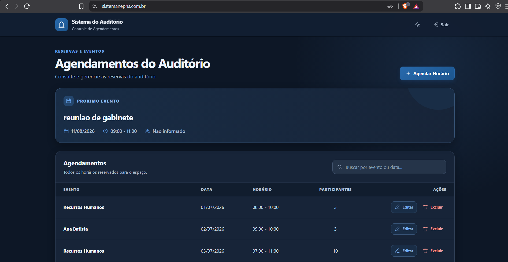

## Olá, eu sou Eduardo

Sou **Backend Developer** e construo APIs e aplicações web com Python, FastAPI e PostgreSQL. Gosto de transformar regras de negócio em sistemas confiáveis, com atenção à consistência dos dados, segurança, testes e operação em produção.

Atualmente também colaboro com interfaces em Vue.js na SouJunior, ampliando minha visão do produto de ponta a ponta sem perder o foco profissional em backend.

**Estou aberto a oportunidades como desenvolvedor backend Python.** Se você procura alguém que aprende rápido, investiga problemas a fundo e se preocupa com a qualidade da entrega, vamos conversar.

## Projeto em destaque

### [Sistema de Controle do Auditório](https://github.com/eduardonunesfvm/auditorio-sistema)

Aplicação full-stack para administrar a agenda de um auditório institucional. O desafio central é garantir que duas pessoas não reservem o mesmo espaço no mesmo horário, mesmo quando as solicitações chegam simultaneamente.

- **Consistência sob concorrência:** validações na aplicação e `EXCLUDE CONSTRAINT` no PostgreSQL para impedir reservas sobrepostas.
- **Segurança:** autenticação JWT, autorização por perfil e rate limiting atômico no Redis.
- **Qualidade:** testes com Pytest, PostgreSQL real e Playwright, além de CI em múltiplos navegadores.
- **Operação:** Docker, backups com restauração de teste e observabilidade com OpenTelemetry e Grafana Cloud.
- **Experiência do usuário:** consulta de disponibilidade, linha do tempo, fluxo guiado e interface responsiva e acessível.

**Stack:** Python · FastAPI · SQLAlchemy · PostgreSQL · Redis · JavaScript · Docker · GitHub Actions · Playwright · OpenTelemetry

[Explorar o código e a documentação](https://github.com/eduardonunesfvm/auditorio-sistema)

## Colaboração atual

Na [SouJunior](https://github.com/SouJunior), contribuo com o [Stars](https://github.com/SouJunior/stars-webapp), um backoffice desenvolvido com Vue.js. Essa experiência fortalece minha capacidade de colaborar entre frontend e backend, entender fluxos completos e transformar requisitos de produto em interfaces funcionais.

## Tecnologias

**Foco principal**

**Experiência complementar**

## Outros projetos

| Projeto | O que demonstra | Tecnologias |
|---|---|---|
| [Pizza Delivery API](https://github.com/eduardonunesfvm/pizza-delivery-api) | API REST com autenticação JWT, pedidos e arquitetura em camadas | Python, FastAPI, PostgreSQL |
| [StatDraft](https://github.com/eduardonunesfvm/statdraft) | Jogo de simulação com regras de domínio, máquina de estados e interface responsiva | React, TypeScript, Vite, Zustand |

## GitHub em números

  

---

### Vamos construir algo relevante juntos?

[LinkedIn](https://linkedin.com/in/eduardonunesfvm) · [E-mail](mailto:aeonszx2@gmail.com) · [GitHub](https://github.com/eduardonunesfvm)

